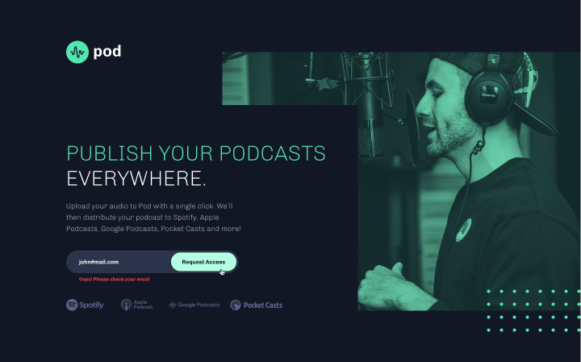

# Podcast Request Landing Page

## Table of contents

- [Overview](#overview)
  - [The challenge](#the-challenge)
  - [Links](#links)
- [My process](#my-process)
  - [Built with](#built-with)
  - [What I learned](#what-i-learned)
  - [Continued development](#continued-development)
  - [Useful resources](#useful-resources)
- [Author](#author)
- [Acknowledgments](#acknowledgments)

## Overview

### The challenge

Users should be able to:

- Receive an error message when the form is submitted if:
  - The Email address field is empty should show "Oops! Please add your email"
  - The email is not formatted correctly should show "Oops! Please check your email"
- View the optimal layout for the interface depending on their device's screen size
- See hover and focus states for all interactive elements on the page

### Links

- Solution URL: [Solution URL](https://github.com/FevenSeyfu/Podcast-landing-page)
- Live Site URL: [Live Site URL](https://podcast-request.netlify.app/)

## My process

### Built with

- Mobile-first workflow
- CSS 
- [React](https://react.dev/)
- [Typescript](https://www.typescriptlang.org/)

### What I learned

With this project I have delved into typescript specifically  event handling and form validation with typescript.

```html

```

```ts
```

### Continued development


### Useful resources

## Author

- Website - [Feven Seyfu](https://fevenseyfu.tech)
- Frontend Mentor - [@FevenSeyfu](https://www.frontendmentor.io/profile/FevenSeyfu)
- Twitter - [@FevenSeyfu](https://www.twitter.com/FevenSeyfu)

## Acknowledgments

I have completed this challenge as part of Womenwhocode frontend, #frontendfriday challenge I would like to thank the community for the feedback as well as the continued support. 
